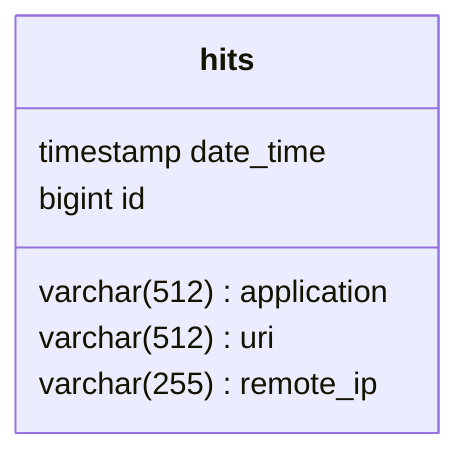

# java-explore-with-me
Repository for diploma project.

    ██████╗██╗  ██╗█████╗ ██╗   █████╗  █████╗ ██████╗ ██╗     ██╗██╗ ██████╗██╗  ██╗ ███╗   ███╗██████╗
    ██╔═══╝╚██╗██╔╝██╔═██╗██║   ██╔══██╗██╔═██╗██╔═══╝ ██║  █╗ ██║╚╝║ ╚═██╔═╝██║  ██║ ████╗ ████║██╔═══╝
    ████╗   ╚███╔╝ █████╔╝██║   ██║  ██║█████╔╝████╗   ╚██╗██╗██╔╝██║   ██║  ███████║ ██╔████╔██║████╗
    ██╔═╝   ██╔██╗ ██╔══╝ ██║   ██║  ██║██╔═██╗██╔═╝    ███╔═███║ ██║   ██║  ██╔══██║ ██║╚██╔╝██║██╔═╝
    ██████╗██╔╝╚██╗██║    █████╗╚█████╔╝██║ ██║██████╗  ╚█╔╝ ╚█╔╝ ██║   ██║  ██║  ██║ ██║ ╚═╝ ██║██████╗
    ╚═════╝╚═╝  ╚═╝╚═╝    ╚════╝ ╚════╝ ╚═╝ ╚═╝╚═════╝   ╚╝   ╚╝  ╚═╝   ╚═╝  ╚═╝  ╚═╝ ╚═╝     ╚═╝╚═════╝

Service for sharing information about interesting events and finding a company to participate in them.

Main service database schema:
```mermaid
classDiagram
direction BT
class categories {
   varchar(255) name
   bigint id
}
class comments {
   varchar text
   bigint author_id
   timestamp created
   bigint event_id
   bigint id
}
class compilations {
   varchar(255) title
   boolean pinned
   bigint id
}
class events {
   varchar title
   varchar description
   varchar annotation
   timestamp event_date
   timestamp created_on
   timestamp published_on
   integer participant_limit
   bigint confirmedRequests
   boolean request_moderation
   boolean paid
   varchar state
   bigint category_id
   bigint initiator_id
   bigint location_id
   bigint id
}
class node7 {
   bigint event_id
   bigint compilation_id
}
class locations {
   numeric lat
   numeric lon
   bigint id
}
class requests {
   bigint event_id
   bigint requester_id
   timestamp created
   varchar status
   bigint id
}
class users {
   varchar(255) email
   varchar(512) name
   bigint id
}

comments  -->  events : event_id:id
comments  -->  users : author_id:id
events  -->  categories : category_id:id
events  -->  locations : location_id:id
events  -->  users : initiator_id:id
node7  -->  compilations : compilation_id:id
node7  -->  events : event_id:id
requests  -->  events : event_id:id
requests  -->  users : requester_id:id
```

Statistics service database schema:
