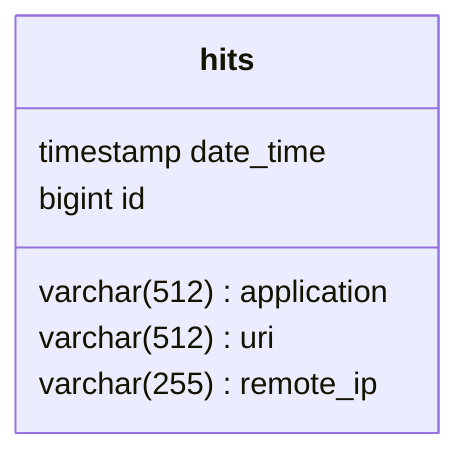

# java-explore-with-me
Repository for diploma project.

    ██████╗██╗  ██╗█████╗ ██╗   █████╗  █████╗ ██████╗ ██╗     ██╗██╗ ██████╗██╗  ██╗ ███╗   ███╗██████╗
    ██╔═══╝╚██╗██╔╝██╔═██╗██║   ██╔══██╗██╔═██╗██╔═══╝ ██║  █╗ ██║╚╝║ ╚═██╔═╝██║  ██║ ████╗ ████║██╔═══╝
    ████╗   ╚███╔╝ █████╔╝██║   ██║  ██║█████╔╝████╗   ╚██╗██╗██╔╝██║   ██║  ███████║ ██╔████╔██║████╗
    ██╔═╝   ██╔██╗ ██╔══╝ ██║   ██║  ██║██╔═██╗██╔═╝    ███╔═███║ ██║   ██║  ██╔══██║ ██║╚██╔╝██║██╔═╝
    ██████╗██╔╝╚██╗██║    █████╗╚█████╔╝██║ ██║██████╗  ╚█╔╝ ╚█╔╝ ██║   ██║  ██║  ██║ ██║ ╚═╝ ██║██████╗
    ╚═════╝╚═╝  ╚═╝╚═╝    ╚════╝ ╚════╝ ╚═╝ ╚═╝╚═════╝   ╚╝   ╚╝  ╚═╝   ╚═╝  ╚═╝  ╚═╝ ╚═╝     ╚═╝╚═════╝

Service for sharing information about interesting events and finding a company to participate in them.

Statistics service database schema:

